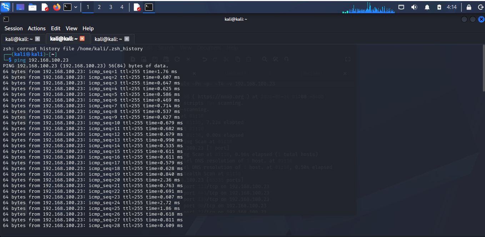
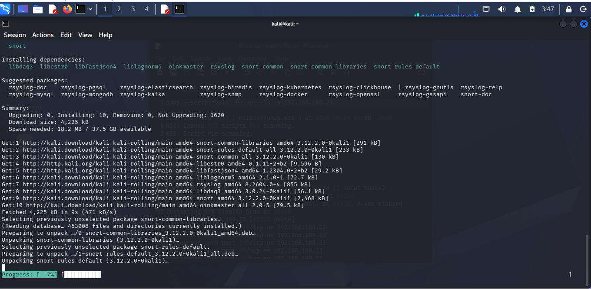
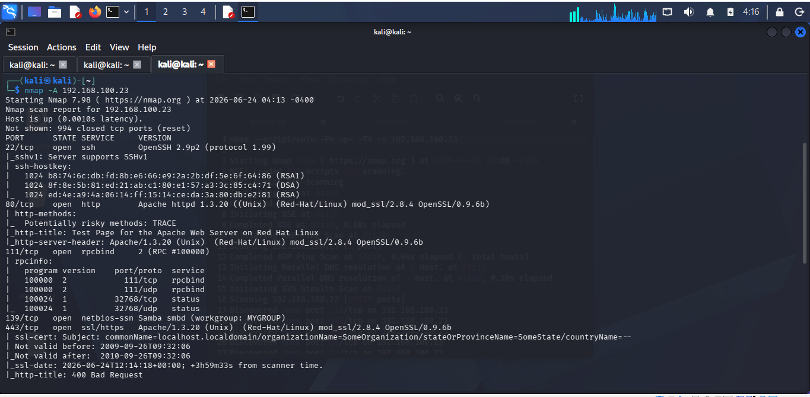
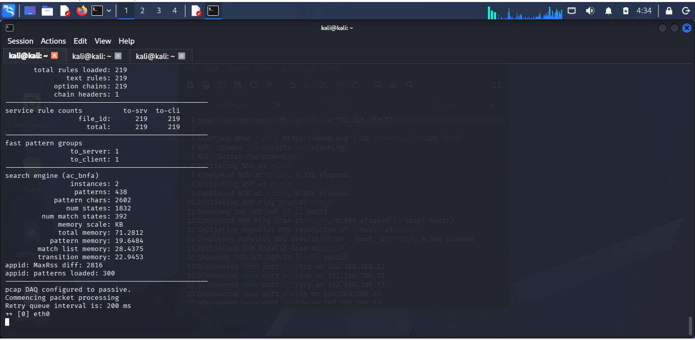
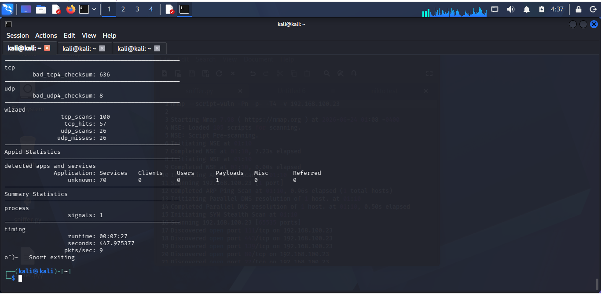

# Network Intrusion Detection System (IDS) Using Snort

## Project Overview

This project demonstrates the deployment and configuration of a Network Intrusion Detection System (IDS) using Snort on Kali Linux.

The objective was to monitor network traffic, detect reconnaissance activities, and analyze suspicious network behavior in a controlled lab environment.

---

## Tools Used

- Kali Linux
- Snort IDS
- Nmap
- Kioptrix Vulnerable Machine
- VirtualBox

---

## Lab Architecture

Attacker Machine:
- Kali Linux
- IP Address: 192.168.100.14

Target Machine:
- Kioptrix
- IP Address: 192.168.100.23

Network Mode:
- Bridged Adapter

---

## Implementation Steps

### 1. Verify Connectivity

The attacker machine successfully communicated with the target machine using ICMP.

### 2. Install Snort

Snort was installed and configured on Kali Linux.

### 3. Validate Configuration

The Snort configuration was tested successfully with no warnings.

### 4. Start Packet Inspection

Snort was launched in network monitoring mode on interface eth0.

### 5. Generate Traffic

Network reconnaissance traffic was generated using:

- Ping
- Nmap Port Scanning

### 6. Monitor and Analyze

Snort monitored incoming and outgoing packets and produced statistics on observed traffic.

---

## Results

The IDS successfully detected and processed:

- TCP Scan Activities
- UDP Scan Activities
- Network Reconnaissance Traffic
- Application Service Detection Events

Sample statistics observed:

- TCP Scans Detected
- UDP Scans Detected
- TCP Hits Recorded
- Network Traffic Analysis Completed

---

## Screenshots

### Connectivity Test

### Snort Installation

### Nmap Scan

### Snort Monitoring

### Snort Statistics

---

## Key Skills Demonstrated

- Intrusion Detection Systems (IDS)
- Snort Deployment
- Network Traffic Analysis
- Threat Monitoring
- Linux Administration
- Nmap Reconnaissance
- Cybersecurity Operations
- Security Monitoring

---

## Conclusion

This project demonstrates practical experience in deploying and operating a network-based Intrusion Detection System using Snort.

The IDS successfully monitored network traffic and detected reconnaissance activities generated against a target machine, providing visibility into potential security threats.

---

## Author

**Chinedu Okoli**

Aspiring SOC Analyst | Cybersecurity Enthusiast | Blue Team Learner

GitHub:
https://github.com/chinedu-okoli07
